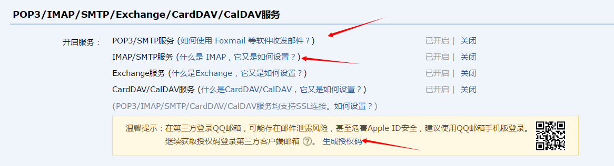
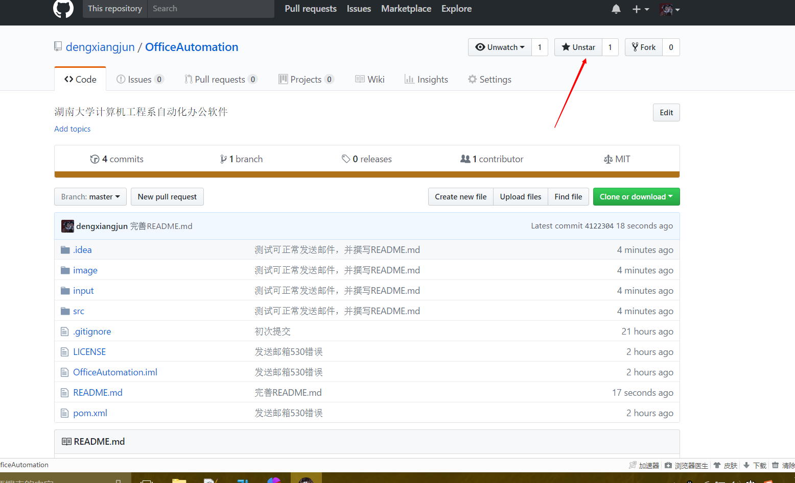

# OfficeAutomation
[湖南大学计算机工程系自动化办公软件](https://github.com/dengxiangjun/OfficeAutomation)
## 为什么写这个项目？
平时看见年级长收材料的时候，需要逐一检查文件夹中的各个人的材料，然后找出未提交得人，再逐一催促
## 项目能做什么？
检查文件夹中的材料，找出未提交材料的人，并发送邮箱给他们

## 使用指南
1. 项目导入时刷新maven即可下载相关的jar包
2. 系统使用的发送邮箱的账户是QQ邮箱
3. QQ邮箱需要开启POP3/SMTP和IMAP/SMTP服务
4. 在src目录下的config.properties中配置QQ邮箱的账号和授权码(授权码需要在QQ邮箱中获得)，[获得授权码](https://jingyan.baidu.com/article/fedf0737af2b4035ac8977ea.html)
5. input目录下有学生基本表模板:学生信息表.xlsx，列的顺序必须与模板的顺序一致。学生信息表中有所有的学生的基本信息，包括姓名、学号、QQ邮箱

## 喜欢的同学帮忙点个赞

